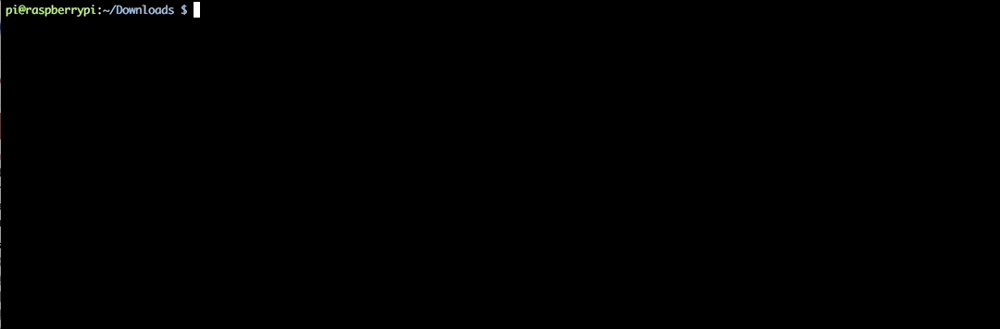
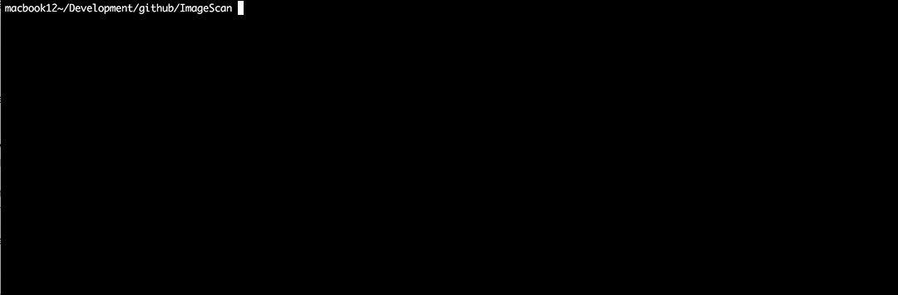

# ImageScan
--

[](https://github.com/jmsamples/ImageScan.git)

ImageScan calculates the sum of the first 1000 bytes
 of all jpg files in a given directory.

### Bash Solution (unix variants only)

The following is a one-liner which will give the expected output. This was tested on Ubuntu and Debian (OSX will fail as ***od*** is missing the *-w* switch)

```bash
for file in *.jpg; do od -w1 -An -vt d1 -N1000 $file | awk '{s+=$1} END {printf s}'; echo ": $file" ; done | sort -n
```



### Java Solution

To build and run the application: 
 
   ```bash
   gradle clean build
   gradle fatJar
   java -jar ./build/libs/ImageScan-all-1.0.jar [dir]
   ```  
where [dir] is the location of the image files.




--
[https://github.com/jmsamples/ImageScan.git](https://github.com/jmsamples/ImageScan.git)
